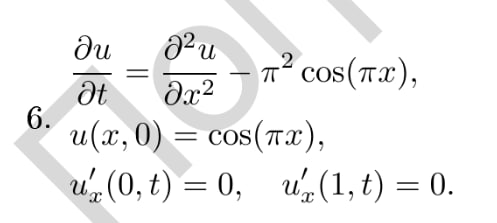

# Численное решение уравнение теплопроводности

## Дано

Задано уравнение теплопроводности с краевыми задачами:

## Найти

Программа должна принимать два параметра:

* **N** - число разбиений отрезка [0, 1] по пространственной координате.
* **T** - конечный момент времени, до которого производится численное интегрирование.

Результатом работы программы является текстовый файл, содержащий распределение температуры u(x, T)
в момент времени t=T.

## Структура

* **Program**: программа на C++.
* **Graphic**: программа на Python для сбора и отрисовки данных.
* **Results**: результаты лабораторной работы.

