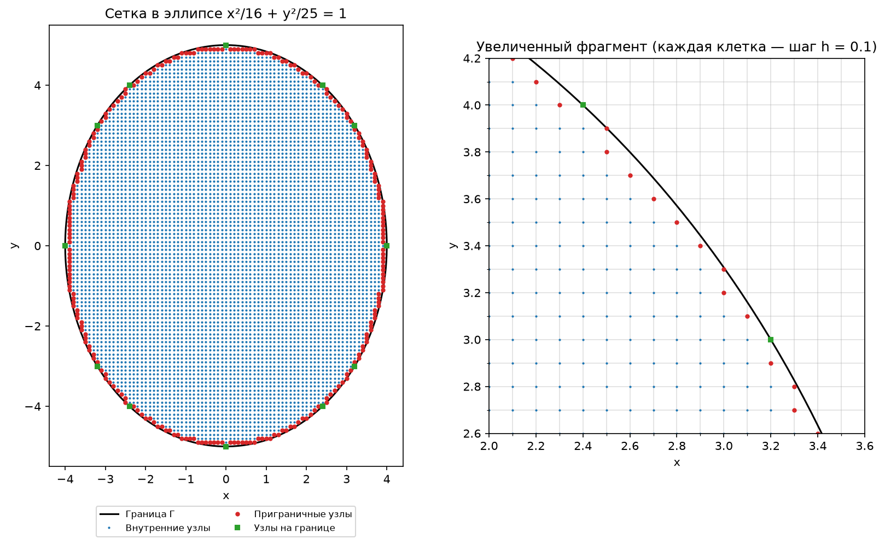
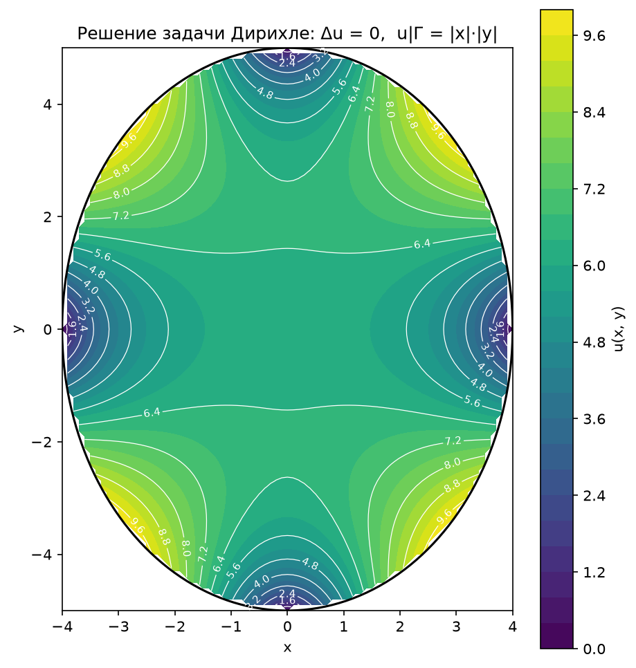
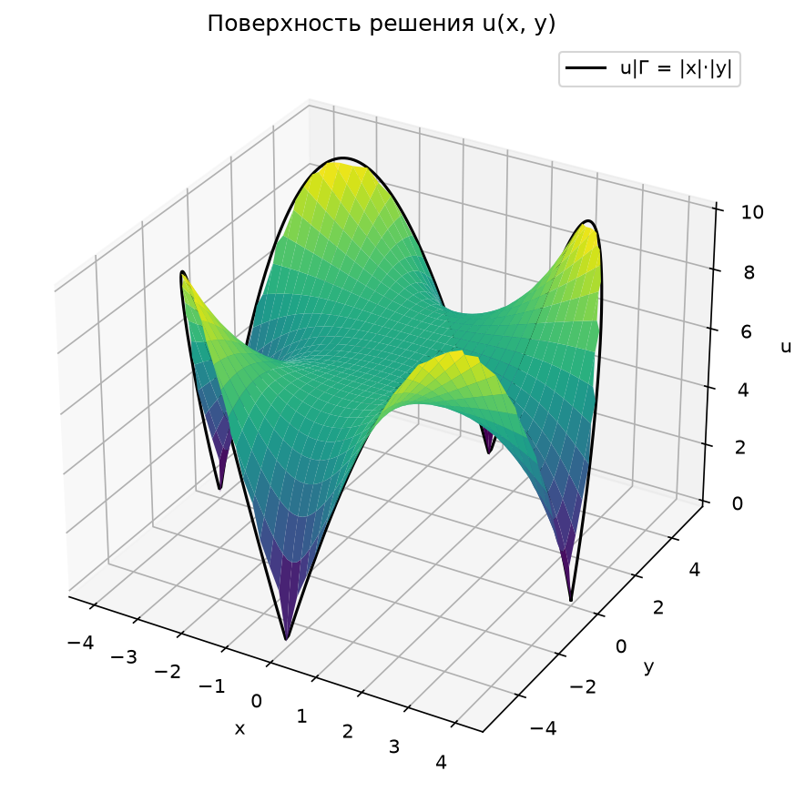
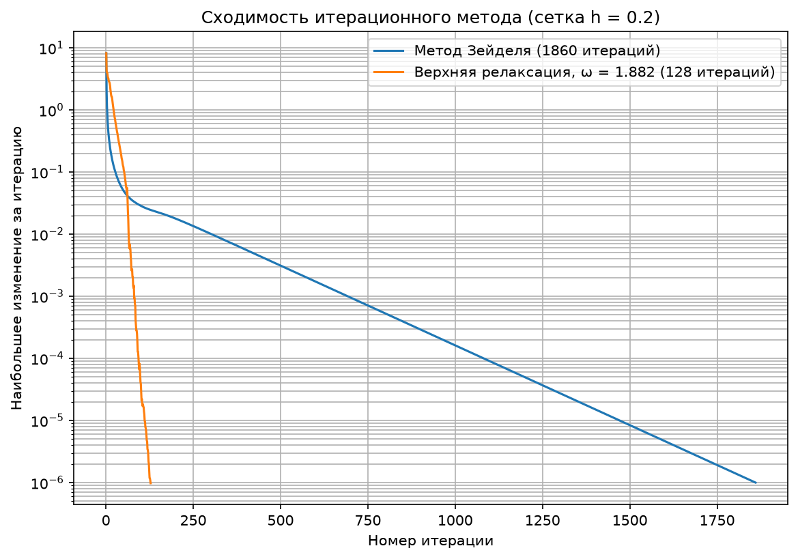
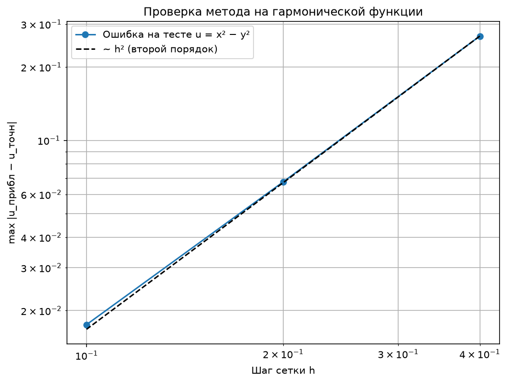

# Численные методы решения задачи Дирихле

Лабораторная работа №8 из учебного пособия Матвеева В. Н. «Лабораторные работы по курсу "Методы вычислений"» (у нас
она идёт четвёртой). Вариант **10**.

## Дано

Уравнение Лапласа в области D с границей Γ:

```
∂²u/∂x² + ∂²u/∂y² = 0   в D,

D:  x²/16 + y²/25 < 1   (эллипс с полуосями 4 по x и 5 по y),

u|Γ = |x|·|y|.
```

## Найти

Приближённое решение задачи. Как требует методичка, для криволинейной границы нужно:

1) определить минимальный прямоугольник, содержащий область D;
2) определить значения искомой функции в граничных узлах с возможно меньшей погрешностью;
3) построить разностную систему и решить её итерационным методом (метод выбирается самостоятельно).

Шаги h₁ и h₂ должны быть порядка 0.1.

## Структура

* **python/src/main/const.py**: исходные данные варианта (эллипс, граничные значения, шаг, точность).
* **python/src/main/methods.py**: сетка, классификация узлов, аппроксимация границы, итерационный метод.
* **python/src/main/draw.py**: графики на matplotlib.
* **python/src/main/main.py**: запуск решения, проверки и вывод результатов в консоль.
* **results**: сохранённые графики.

## Запуск 🚀

```shell
# Запускаем программу из корня репозитория (графики сохранятся в NumericalMethods/Dirichlet/results);
python NumericalMethods/Dirichlet/python/src/main/main.py;
```

Программа работает около 10–15 секунд, потому что заодно решает проверочные задачи.

## Решение

### 1. Минимальный прямоугольник и сетка

Эллипс `x²/16 + y²/25 = 1` целиком помещается в прямоугольник **[−4, 4] × [−5, 5]**, и меньше прямоугольника нет:
крайние точки эллипса — (±4, 0) и (0, ±5).

Берём шаги **h₁ = h₂ = h = 0.1** и строим узлы `x_k = −4 + k·h`, `y_j = −5 + j·h`. Получается сетка 81 × 101.

### 2. Классификация узлов

Каждый узел сетки относим к одному из типов (см. рисунок `grid.png`):

| Тип                 | Условие                                                       | Количество | Что в нём делаем                      |
|---------------------|---------------------------------------------------------------|------------|---------------------------------------|
| Снаружи             | x²/16 + y²/25 > 1                                             | 1912       | не участвует в расчёте                |
| На границе          | x²/16 + y²/25 = 1, например (0, ±5), (±4, 0), (±2.4, ±4)       | 12         | `u = |x|·|y|` — значение известно     |
| Приграничный        | внутри D, но хотя бы один сосед из «креста» снаружи            | 244        | интерполяция к границе (п. 3)         |
| Внутренний          | все четыре соседа «креста» в D или на Γ                       | 6013       | разностное уравнение Лапласа (п. 4)   |

### 3. Значения в приграничных узлах (аппроксимация границы)

Это главная часть работы для криволинейной области. Возьмём приграничный узел A. У него есть сосед снаружи, значит, на
линии сетки между A и этим соседом лежит точка B на эллипсе на расстоянии δ < h. С противоположной стороны от A на
расстоянии h лежит узел C:

```
   C ——— h ——— A —— δ —— B (на эллипсе)
```

Как показано в методичке (разложение в ряд Тейлора в точках B и C),

```
u(A) = (h·u(B) + δ·u(C)) / (h + δ) + O(h²),
```

поэтому в узле A ставим уравнение

```
u_A = (h·φ(B) + δ·u_C) / (h + δ),     φ(B) = |x_B|·|y_B|.
```

Это линейная интерполяция между C и B, её погрешность O(h²). Если «наружных» направлений несколько, выбираем то, где δ
меньше: там точность выше.

Точку B находим из уравнения эллипса:

* по горизонтали (y = y_j фиксирован): `x_B = ±4·√(1 − y_j²/25)`, `δ = |x_B − x_k|`;
* по вертикали (x = x_k фиксирован): `y_B = ±5·√(1 − x_k²/16)`, `δ = |y_B − y_j|`.

### 4. Разностная система

Во внутреннем узле уравнение Лапласа заменяем пятиточечным «крестом» (8.3). При h₁ = h₂ = h, то есть σ = 1 в (8.4),
оно принимает вид

```
u_(k−1,j) + u_(k+1,j) + u_(k,j−1) + u_(k,j+1) − 4·u_(k,j) = 0
⟺   u_(k,j) = (u_(k−1,j) + u_(k+1,j) + u_(k,j−1) + u_(k,j+1)) / 4.
```

Это аппроксимация с погрешностью O(h²). Вместе с уравнениями для приграничных узлов из п. 3 получаем систему из
6013 + 244 = **6257 линейных уравнений** с 6257 неизвестными.

### 5. Итерационный метод

Выбран **метод Зейделя с верхней релаксацией**. Обходим узлы по очереди и сразу используем уже обновлённые значения
соседей (это Зейдель), но шагаем «с запасом» (это релаксация):

```
u_new = u_old + ω·(u_Зейделя − u_old),     ω = 2 / (1 + sin(π/N)),
```

где N = 100 — число шагов сетки по большей стороне прямоугольника; получается ω ≈ 1.939. При ω = 1 это обычный метод
Зейделя. Итерации останавливаем, когда наибольшее изменение за итерацию меньше ε = 10⁻⁶.

Релаксацию применяем только во **внутренних** узлах, а приграничные считаем обычным Зейделем: при ω, близком к 2,
перерелаксация в приграничных узлах раскачивала итерации, и они переставали сходиться (на сетке h = 0.2 расходились
уже при ω ≈ 1.88).

Почему метод сходится: разностный оператор Лапласа симметричный и положительно определённый, а в уравнениях для
приграничных узлов коэффициент `δ/(h + δ) < 1/2`, то есть у системы есть диагональное преобладание. Для таких систем
метод Зейделя сходится с любого начального приближения (методичка ссылается на лабораторную работу №2 книги).

### 6. Проверка метода на задаче с известным решением

Точного решения у нашей задачи в явном виде нет. Чтобы убедиться, что программа считает правильно, ей же решаем
задачу, где ответ известен: функция `u = x² − y²` гармоническая (`u_xx + u_yy = 2 − 2 = 0`), поэтому решение задачи
Дирихле с граничными значениями `x² − y²` — это она сама.

## Результаты 📊

Вывод программы:

```
Минимальный прямоугольник: [-4, 4] x [-5, 5],  h1 = h2 = 0.1
Сетка: 81 x 101 узлов

Типы узлов:
  внутренние (уравнение "крест"):         6013
  приграничные (интерполяция к границе):  244
  лежат прямо на границе:                 12
  снаружи (не участвуют):                 1912

Метод верхней релаксации (omega = 1.9391): 252 итераций

Решение u(x, y) в узлах с целыми координатами ("·" — точка вне области):
  y \ x       -4      -3      -2      -1       0       1       2       3       4
     5         ·       ·       ·       ·   0.000       ·       ·       ·       ·
     4         ·       ·   8.516   6.130   4.996   6.130   8.516       ·       ·
     3         ·   9.295   7.852   6.711   6.250   6.711   7.852   9.295       ·
     2         ·   7.212   6.926   6.603   6.459   6.603   6.926   7.212       ·
     1         ·   5.309   6.061   6.295   6.335   6.295   6.061   5.309       ·
     0     0.000   4.382   5.691   6.146   6.251   6.146   5.691   4.382   0.000
    -1         ·   5.309   6.061   6.295   6.335   6.295   6.061   5.309       ·
    -2         ·   7.212   6.926   6.603   6.459   6.603   6.926   7.212       ·
    -3         ·   9.295   7.852   6.711   6.250   6.711   7.852   9.295       ·
    -4         ·       ·   8.516   6.130   4.996   6.130   8.516       ·       ·
    -5         ·       ·       ·       ·   0.000       ·       ·       ·       ·

Сравнение итерационных методов на сетке h = 0.2:
  метод Зейделя (omega = 1):                1860 итераций
  верхняя релаксация (omega = 1.8818):    128 итераций

Проверка метода на тестовой задаче u|Г = x² − y² (точное решение u = x² − y²):
     h       ошибка  отношение
   0.4     0.268176
   0.2     0.067547       3.97
   0.1     0.017519       3.86
```











## Выводы

* Решение **симметрично** относительно обеих осей, как и граничные значения `|x|·|y|`, и это хорошая проверка
  правильности.
* Выполняется **принцип максимума** для гармонических функций: на границе `|x|·|y| = 10·|sin 2θ|` (если x = 4cos θ,
  y = 5sin θ) меняется от 0 до 10, и внутри решение тоже лежит между 0 и 10. Наибольшие значения (~9.3) получаются
  возле точек границы, где `|x|·|y|` максимально, а наименьшие — возле концов осей, где на границе 0. В центре
  решение почти ровное, около 6.25.
* **Проверка на `x² − y²`**: при уменьшении шага вдвое ошибка уменьшается примерно в 4 раза (3.97, 3.86). Значит,
  вся схема, вместе с аппроксимацией криволинейной границы, имеет второй порядок O(h²), как и утверждается в
  методичке. Отдельный прогон на сетке h = 0.05 дал ошибку 0.0045 (ещё в 3.9 раза меньше).
* **Верхняя релаксация** сходится намного быстрее обычного метода Зейделя: на сетке h = 0.2 за 128 итераций вместо
  1860, примерно в 15 раз быстрее. На основной сетке h = 0.1 хватило 252 итераций.
