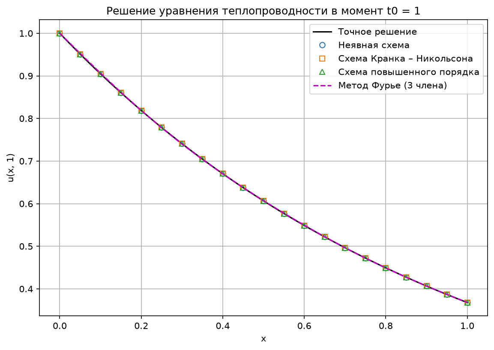
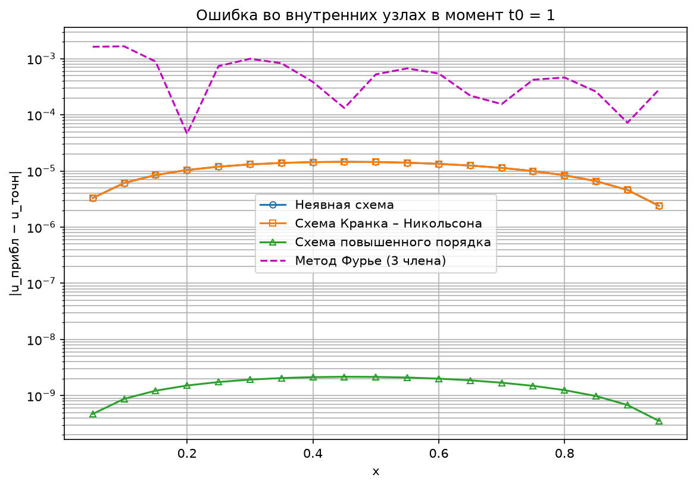
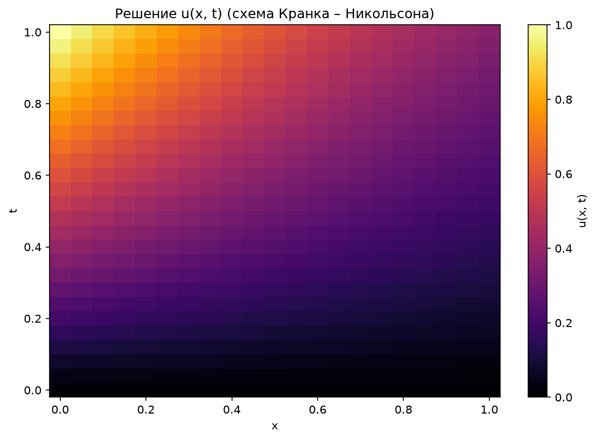

# Численные методы решения краевых задач для уравнения теплопроводности

Лабораторная работа №7 из учебного пособия Матвеева В. Н. «Лабораторные работы по курсу "Методы вычислений"» (у нас
она идёт третьей). Вариант **13**.

## Дано

```
∂u/∂t = ∂²u/∂x² + (1 − t)·e^(−x),   0 ≤ x ≤ 1,

u(x, 0) = 0,        u(0, t) = t,        u(1, t) = t·e^(−1).
```

Параметры сетки: **n = 20, m = 25, t₀ = 1** (h = 1/n = 0.05, τ = t₀/m = 0.04).

> ⚠️ В методичке таблица значений n, m, t₀ содержит 6 строк, а номер варианта 13. Взята первая строка
> (13 mod 6 = 1). Если преподаватель выдал другие значения, их достаточно поменять в `const.py` (переменные
> `n`, `m`, `t0`).

## Найти

При t = t₀ в точках xᵢ, i = 0, 1, …, n:

1) приближённое решение сеточной краевой задачи. Реализованы все три схемы из методички:
    * неявная схема;
    * схема Кранка – Никольсона;
    * схема повышенного порядка аппроксимации.

   Сеточная задача на каждом слое решается прогонкой. Реализованы все четыре метода: правая, левая и встречная
   прогонка, а также метод стрельбы.
2) приближённое решение методом Фурье (разделения переменных) в виде ряда до третьего члена.

## Структура

* **python/src/main/const.py**: исходные данные варианта, точное решение, параметры сетки.
* **python/src/main/solvers.py**: методы решения трёхдиагональной системы (прогонки и стрельба).
* **python/src/main/methods.py**: три разностные схемы и метод Фурье.
* **python/src/main/draw.py**: графики на matplotlib.
* **python/src/main/main.py**: запуск всего решения и вывод таблицы в консоль.
* **results**: сохранённые графики.

## Запуск 🚀

```shell
# Запускаем программу из корня репозитория (графики сохранятся в NumericalMethods/HeatEquation/results);
python NumericalMethods/HeatEquation/python/src/main/main.py;
```

## Решение

### 0. Точное решение (для проверки)

Методичка не требует точного решения, но оно здесь легко угадывается, и с ним удобно сравнивать результаты.
Краевые условия `u(0, t) = t`, `u(1, t) = t·e^(−1)` подсказывают попробовать **u(x, t) = t·e^(−x)**. Проверяем:

```
u_t  = e^(−x),
u_xx = t·e^(−x),
u_t − u_xx = (1 − t)·e^(−x)   ✅  (совпадает с правой частью f)

u(x, 0) = 0 ✅,   u(0, t) = t ✅,   u(1, t) = t·e^(−1) ✅.
```

Решение задачи единственно, значит **u(x, t) = t·e^(−x)** — точное решение.

### 1. Разностные схемы

Отрезок [0, 1] делим с шагом h = 1/n (узлы xᵢ), отрезок [0, t₀] — с шагом τ = t₀/m (слои tⱼ). Обозначаем
`uᵢʲ ≈ u(xᵢ, tⱼ)` и `Λuᵢ = (uᵢ₋₁ − 2uᵢ + uᵢ₊₁)/h²` (разностная вторая производная по x).

Все три схемы — частные случаи **схемы с весом σ**:

```
(uᵢʲ⁺¹ − uᵢʲ)/τ = σ·Λuᵢʲ⁺¹ + (1 − σ)·Λuᵢʲ + φᵢʲ,     uᵢ⁰ = φ(xᵢ) = 0.
```

| Схема                    | σ                    | φᵢʲ                                         | Порядок аппроксимации | Устойчивость         |
|--------------------------|----------------------|---------------------------------------------|-----------------------|----------------------|
| Неявная                  | 1                    | f(xᵢ, tⱼ₊₁)                                  | O(h² + τ)             | абсолютно устойчива  |
| Кранка – Никольсона      | 1/2                  | (f(xᵢ, tⱼ) + f(xᵢ, tⱼ₊₁))/2                  | O(h² + τ²)            | абсолютно устойчива  |
| Повышенного порядка      | 1/2 − h²/(12τ)       | f + (h²/12)·f″ₓₓ в точке (xᵢ, tⱼ + τ/2)      | O(h⁴ + τ²)            | абсолютно устойчива  |

У нас h = 0.05, τ = 0.04, поэтому для схемы повышенного порядка σ = 1/2 − 0.0025/0.48 ≈ **0.494792**.
Для нашей f: `f″ₓₓ = (1 − t)·e^(−x) = f`.

**Как получить систему для нового слоя.** Умножаем схему на h²/σ, обозначаем `yᵢ = uᵢʲ⁺¹` (неизвестные) и переносим
всё известное со старого слоя вправо:

```
yᵢ₋₁ − (2 + h²/(τσ))·yᵢ + yᵢ₊₁ = gᵢ,

gᵢ = −h²/(τσ)·uᵢʲ − (1 − σ)/σ·(uᵢ₋₁ʲ − 2uᵢʲ + uᵢ₊₁ʲ) − (h²/σ)·φᵢʲ.
```

При σ = 1 это ровно формула (7.12) методички, при σ = 1/2 — формула для схемы Кранка – Никольсона, а в общем
случае — формула для νᵢ из методички.

**Краевые условия на новом слое:** `y₀ = γ₁(tⱼ₊₁) = tⱼ₊₁`, `yₙ = γ₂(tⱼ₊₁) = tⱼ₊₁/e`. В форме (6.6):
χ₁ = 0, μ₁ = tⱼ₊₁, χ₂ = 0, μ₂ = tⱼ₊₁/e.

Получилась та же трёхдиагональная задача, что и в лабораторной BoundaryValue: `yᵢ₋₁ + dᵢyᵢ + eᵢyᵢ₊₁ = gᵢ` с
dᵢ = −(2 + h²/(τσ)), eᵢ = 1. Решаем её прогонкой.

**Алгоритм:**

1. Нулевой слой: uᵢ⁰ = 0.
2. Для j = 0, 1, …, m − 1: считаем правую часть gᵢ по слою j, решаем систему прогонкой и получаем слой j + 1.
3. Слой m — это решение при t = t₀.

> В методичке в краевых условиях (7.7), (7.8) стоит h² вместо h — это опечатка. В коде используется
> `(u₁ − u₀)/h` (для нашего варианта это не важно: условия первого рода, производных в них нет).

### 2. Метод Фурье (разделение переменных)

**Шаг 1. Делаем краевые условия нулевыми.** Берём `w(x, t) = t + (t/e − t)·x` — прямую, которая на краях равна
t и t/e. Подставляем `u = v + w`:

```
v_t = v_xx + G(x, t),     v(0, t) = v(1, t) = 0,     v(x, 0) = Φ(x),

G(x, t) = f − w_t + w_xx = (1 − t)·e^(−x) − (1 + (1/e − 1)·x),
Φ(x)    = φ(x) − w(x, 0) = 0.
```

**Шаг 2. Собственные функции.** Задача `y'' = λy`, `y(0) = y(1) = 0` имеет решения

```
e_k(x) = sin(kπx),     λ_k = −(kπ)²,     k = 1, 2, 3, …
```

**Шаг 3. Раскладываем G по синусам:** `G(x, t) = Σ G_k(t)·sin(kπx)`, где `G_k(t) = 2∫₀¹ G(x, t)·sin(kπx) dx`.
Понадобятся три интеграла (берутся по частям):

```
I₁ = ∫₀¹ e^(−x)·sin(kπx) dx = kπ·(1 − (−1)ᵏ·e^(−1)) / (1 + k²π²),
I₂ = ∫₀¹ sin(kπx) dx        = (1 − (−1)ᵏ) / (kπ),
I₃ = ∫₀¹ x·sin(kπx) dx      = (−1)ᵏ⁺¹ / (kπ).
```

Тогда

```
G_k(t) = 2·[(1 − t)·I₁ − I₂ − (1/e − 1)·I₃] = a_k + b_k·t,
a_k = 2·(I₁ − I₂ − (1/e − 1)·I₃),     b_k = −2·I₁.
```

**Шаг 4. Обыкновенные уравнения для коэффициентов.** Ищем `v = Σ v_k(t)·sin(kπx)` и получаем для каждого k:

```
v_k'(t) = −(kπ)²·v_k + a_k + b_k·t,     v_k(0) = Φ_k = 0.
```

Это линейное ОДУ первого порядка. Частное решение ищем в виде `c₀ + c₁t`:

```
c₁ = b_k / (kπ)²,     c₀ = (a_k − c₁) / (kπ)²,

v_k(t) = c₀ + c₁·t − c₀·e^(−(kπ)²·t).
```

**Шаг 5. Ответ (до третьего члена):**

```
u(x, t) ≈ t + (t/e − t)·x + Σ_(k=1..3) v_k(t)·sin(kπx).
```

Численные значения коэффициентов при t₀ = 1 программа считает сама. Формулы для `G_k` мы дополнительно проверили
численным интегрированием: совпадение до 10⁻¹¹.

## Результаты 📊

Вывод программы (фрагмент таблицы при t = t₀ = 1):

```
Неявная схема                sigma = 1.000000
Схема Кранка – Никольсона    sigma = 0.500000
Схема повышенного порядка    sigma = 0.494792

  i    x_i       точное          Неявная  Кранк–Никольсон   Повыш. порядок    Фурье (3 чл.)
  0   0.00   1.00000000       1.00000000       1.00000000       1.00000000       1.00000000
  4   0.20   0.81873075       0.81874115       0.81874115       0.81873075       0.81868459
  8   0.40   0.67032005       0.67033443       0.67033443       0.67032004       0.66993548
 12   0.60   0.54881164       0.54882502       0.54882502       0.54881163       0.54935489
 16   0.80   0.44932896       0.44933736       0.44933736       0.44932896       0.44886728
 20   1.00   0.36787944       0.36787944       0.36787944       0.36787944       0.36787944

Максимальная ошибка |u_прибл - u_точн| при t = t0:
  Неявная схема                1.456e-05
  Схема Кранка – Никольсона    1.456e-05
  Схема повышенного порядка    2.168e-09
  Метод Фурье (3 члена)        1.658e-03

Расхождение методов решения сеточной задачи с правой прогонкой (схема Кранка – Никольсона):
  Правая прогонка      0.000e+00
  Левая прогонка       3.331e-16
  Встречная прогонка   4.441e-16
  Метод стрельбы       1.883e-13
```

Полную таблицу по всем 21 узлу программа печатает при запуске.







## Выводы

* Все три разностные схемы дают решение, очень близкое к точному.
* **Неявная схема и схема Кранка – Никольсона дали одинаковую ошибку (~1.5·10⁻⁵)**, и на графике ошибок их линии
  совпадают. Причина в том, что точное решение `t·e^(−x)` линейно по t, а для линейной по t функции разностная
  производная `(uʲ⁺¹ − uʲ)/τ` точна, то есть ошибки по времени у обеих схем нет. Остаётся только ошибка по x
  порядка O(h²), а она у этих схем одинаковая. Для решения, нелинейного по t, схема Кранка – Никольсона была бы
  точнее (O(τ²) против O(τ)).
* **Схема повышенного порядка** убирает и главную часть ошибки по x: её ошибка ~2·10⁻⁹, в тысячи раз меньше.
  При проверке на сетках n = 10, 20, 40 ошибка уменьшалась в ≈16 раз при уменьшении h вдвое (3.4·10⁻⁸ →
  2.2·10⁻⁹ → 1.4·10⁻¹⁰), то есть как h⁴, в точности как обещает теория.
* **Метод Фурье с тремя членами** даёт ошибку ~1.7·10⁻³. Это ошибка обрыва ряда, а не вычислений: с 10 членами
  она ~1.4·10⁻⁴, с 50 членами ~1.6·10⁻⁶, с 200 членами ~5·10⁻⁸.
* Все четыре метода решения сеточной задачи (три прогонки и стрельба) совпадают до ошибок округления (≤ 2·10⁻¹³).
