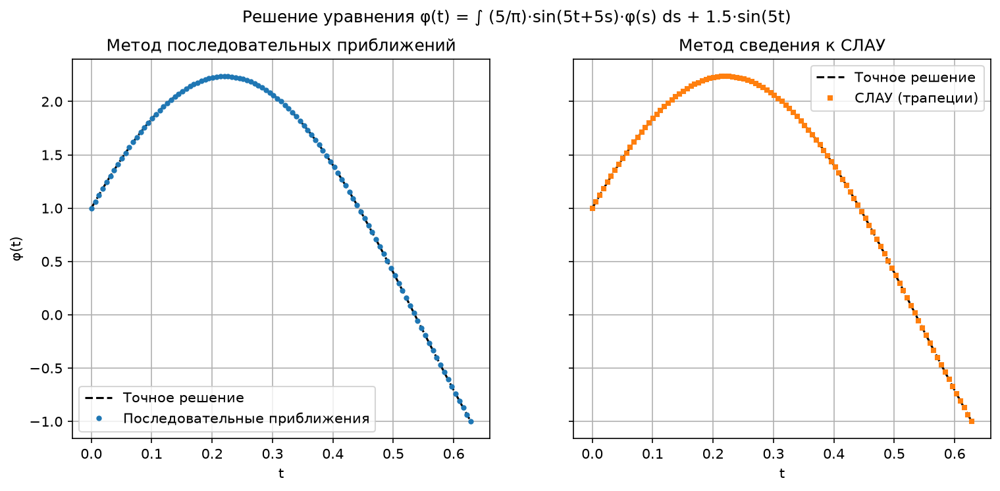
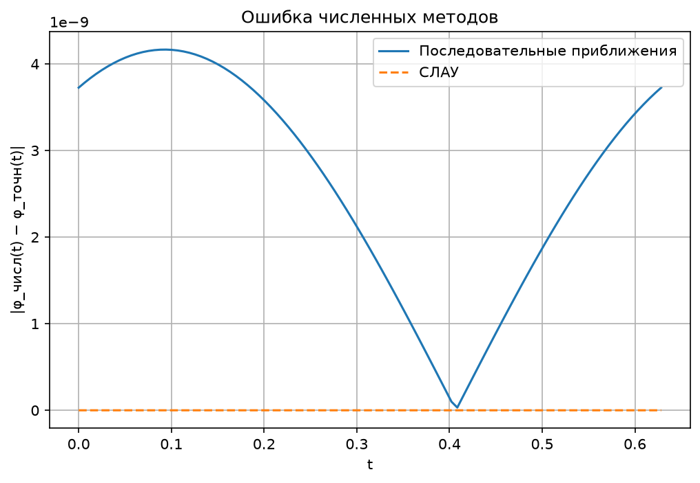
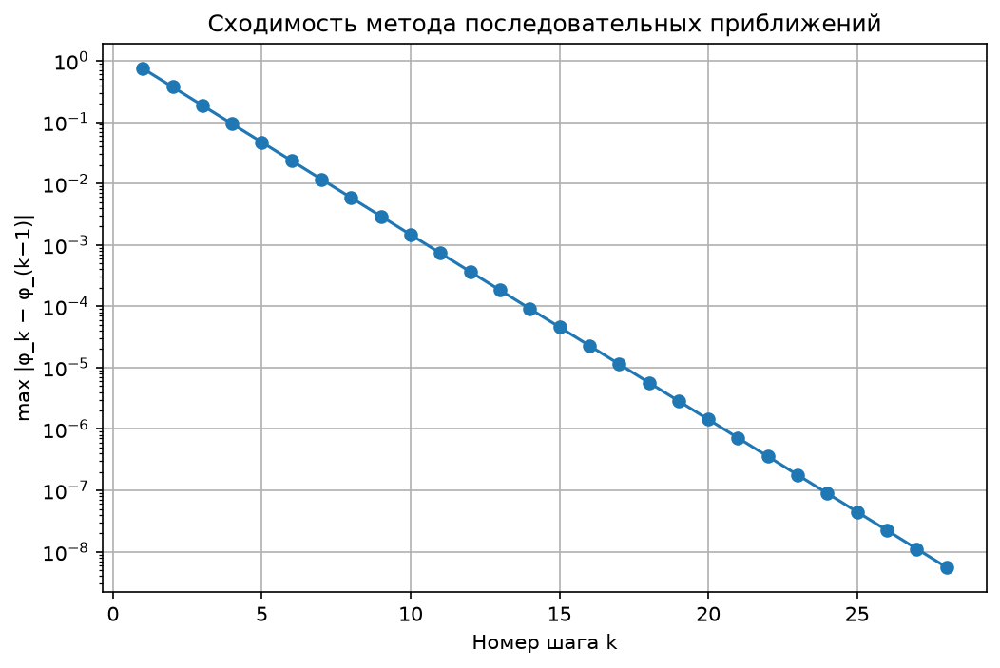

# Решение линейных интегральных уравнений

Лабораторная работа №3 из методических указаний Глазкова Д. В. (у нас она идёт первой). Вариант **3**.

## Дано

Интегральное уравнение Фредгольма второго рода:

```
φ(t) = λ · ∫[a, b] K(t, s) · φ(s) ds + f(t),
```

где:

* a = 0, b = π/5, λ = 1;
* K(t, s) = (5/π) · sin(5t + 5s) — ядро;
* f(t) = (3/2) · sin(5t) — правая часть;
* φ(t) — неизвестная функция.

## Найти

Решить уравнение тремя способами и сравнить результаты:

1) методом последовательных приближений (предварительно проверить условие сжимаемости оператора A при λ = 1);
2) методом сведения к системе линейных алгебраических уравнений (СЛАУ);
3) аналитически.

## Структура

* **python/src/main/const.py**: исходные данные (отрезок, ядро, правая часть, точное решение, точность).
* **python/src/main/methods.py**: проверка сжимаемости и два численных метода.
* **python/src/main/draw.py**: графики на matplotlib.
* **python/src/main/main.py**: запуск всего решения и вывод результатов в консоль.
* **results**: сохранённые графики.

## Запуск 🚀

```shell
# Запускаем программу из корня репозитория (графики сохранятся в NumericalMethods/Lab1/results);
python NumericalMethods/Lab1/python/src/main/main.py;
```

## Решение

### 1. Аналитическое решение

Раскроем синус суммы:

```
sin(5t + 5s) = sin(5t)·cos(5s) + cos(5t)·sin(5s).
```

Ядро распалось на произведения «функция от t» × «функция от s». Такое ядро называется **вырожденным**. Подставим его в
уравнение и вынесем функции от t за знак интеграла:

```
φ(t) = (5/π) · sin(5t) · C₁ + (5/π) · cos(5t) · C₂ + (3/2) · sin(5t),

C₁ = ∫[0, π/5] cos(5s) · φ(s) ds,
C₂ = ∫[0, π/5] sin(5s) · φ(s) ds.
```

C₁ и C₂ — просто **числа** (интеграл по s даёт число). Значит, решение имеет вид

```
φ(t) = A · sin(5t) + B · cos(5t),   где   A = (5/π)·C₁ + 3/2,   B = (5/π)·C₂.
```

Осталось найти A и B. Понадобятся три интеграла (замена u = 5s переводит отрезок [0, π/5] в [0, π]):

```
∫[0, π/5] sin²(5s) ds = π/10,
∫[0, π/5] cos²(5s) ds = π/10,
∫[0, π/5] sin(5s)·cos(5s) ds = 0.
```

Подставляем φ(s) = A·sin(5s) + B·cos(5s) в C₁ и C₂:

```
C₁ = A · 0 + B · π/10 = B·π/10,
C₂ = A · π/10 + B · 0 = A·π/10.
```

Тогда:

```
A = (5/π)·(B·π/10) + 3/2 = B/2 + 3/2,
B = (5/π)·(A·π/10)       = A/2.
```

Из второго уравнения B = A/2, подставляем в первое: A = A/4 + 3/2, откуда **A = 2**, **B = 1**.

**Ответ:**

```
φ(t) = 2·sin(5t) + cos(5t).
```

**Проверка** при t = 0: слева φ(0) = 1. Справа f(0) = 0, а интеграл равен
(5/π)·∫ sin(5s)·(2·sin(5s) + cos(5s)) ds = (5/π)·(2·π/10 + 0) = 1. Сходится ✅.

### 2. Проверка сжимаемости оператора A (λ = 1)

Оператор `Aφ = λ·∫ K(t, s)·φ(s) ds + f(t)` сжимающий, если выполнено хотя бы одно из условий:

| Пространство | Величина                                    | Условие           | Значение      | Итог          |
|--------------|---------------------------------------------|-------------------|---------------|---------------|
| C[a, b]      | M = max \|K(t, s)\| = 5/π                   | \|λ\|·M·(b−a) < 1 | (5/π)·(π/5) = 1 | ❌ не выполнено (ровно граница) |
| L2[a, b]     | B = (∫∫ K²(t, s) dt ds)^(1/2) = 1/√2       | \|λ\|·B < 1       | ≈ 0.7071      | ✅ выполнено   |

Значение B получается так: ∫∫ (25/π²)·sin²(5t + 5s) dt ds после замены u = 5t, v = 5s равен
(1/π²)·∫[0, π]∫[0, π] sin²(u + v) du dv = (1/π²)·(π²/2) = 1/2.

В пространстве L2 оператор сжимающий, значит метод последовательных приближений сходится.

### 3. Метод последовательных приближений

Начинаем с φ₀(t) = f(t) и повторяем

```
φ_(k+1)(t) = λ · ∫[a, b] K(t, s) · φ_k(s) ds + f(t),
```

пока max |φ_(k+1) − φ_k| не станет меньше ε = 10⁻⁸. Интеграл считается по формуле трапеций на сетке из n = 100 отрезков.

### 4. Метод сведения к СЛАУ

Делим [a, b] на n = 100 частей: t_j = a + j·(b − a)/n. Интеграл заменяем формулой трапеций и записываем уравнение в
каждом узле t_j. Получается система из n + 1 = 101 уравнения:

```
(I − Q)·φ = f,   Q_jk = λ · w_k · K(t_j, t_k),
```

где w_k — веса трапеций (h/2 у крайних узлов и h у внутренних, h = (b − a)/n). Систему решаем через
`numpy.linalg.solve`.

## Результаты 📊

Вывод программы:

```
Проверка сжимаемости оператора A (λ = 1):
  M = max|K| = 1.591549,  |λ|·M·(b−a) = 1.000000  ->  НЕ выполнено (нужно < 1)
  B = ||K||_L2 = 0.707106,  |λ|·B = 0.707106  ->  выполнено (нужно < 1)

Метод последовательных приближений: 28 шагов до точности 1e-08
Метод СЛАУ: решена система из 101 уравнений

Максимальная ошибка по сравнению с точным решением:
  последовательные приближения: 4.165e-09
  СЛАУ:                         2.220e-15
  разница между двумя методами: 4.165e-09
```







## Выводы

* Все три способа дают одно и то же решение φ(t) = 2·sin(5t) + cos(5t).
* Метод последовательных приближений сошёлся за 28 шагов: на каждом шаге ошибка уменьшается примерно вдвое. Это
  видно на графике сходимости (прямая линия на логарифмической шкале).
* Метод СЛАУ совпал с точным решением до ошибок округления (~10⁻¹⁵). Так получилось потому, что формула трапеций
  точна для sin и cos, проинтегрированных по целому периоду, а у нас как раз такой случай (5s пробегает [0, π]).
* Условие сжимаемости в C[a, b] оказалось на границе (= 1), но в L2[a, b] выполнено (≈ 0.707 < 1), поэтому итерации
  сходятся.
