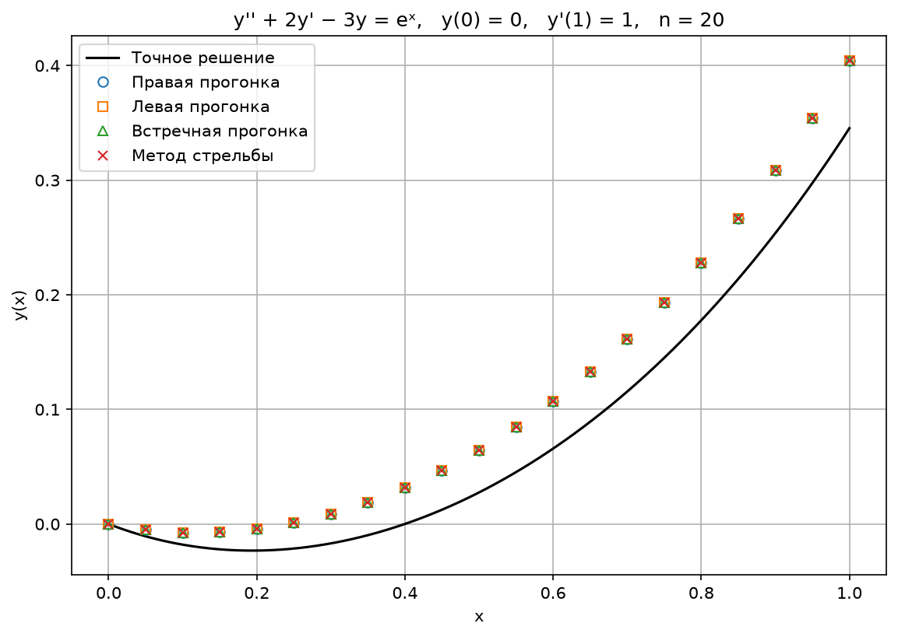
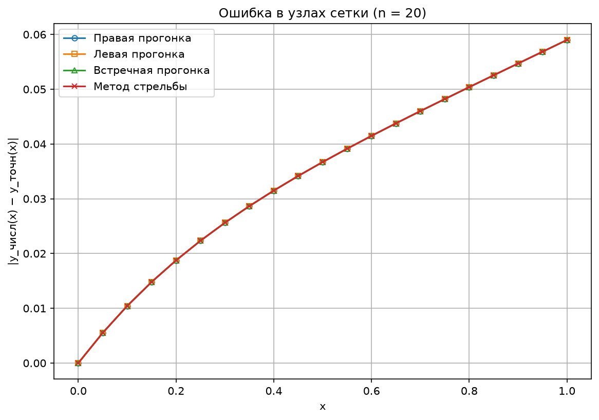
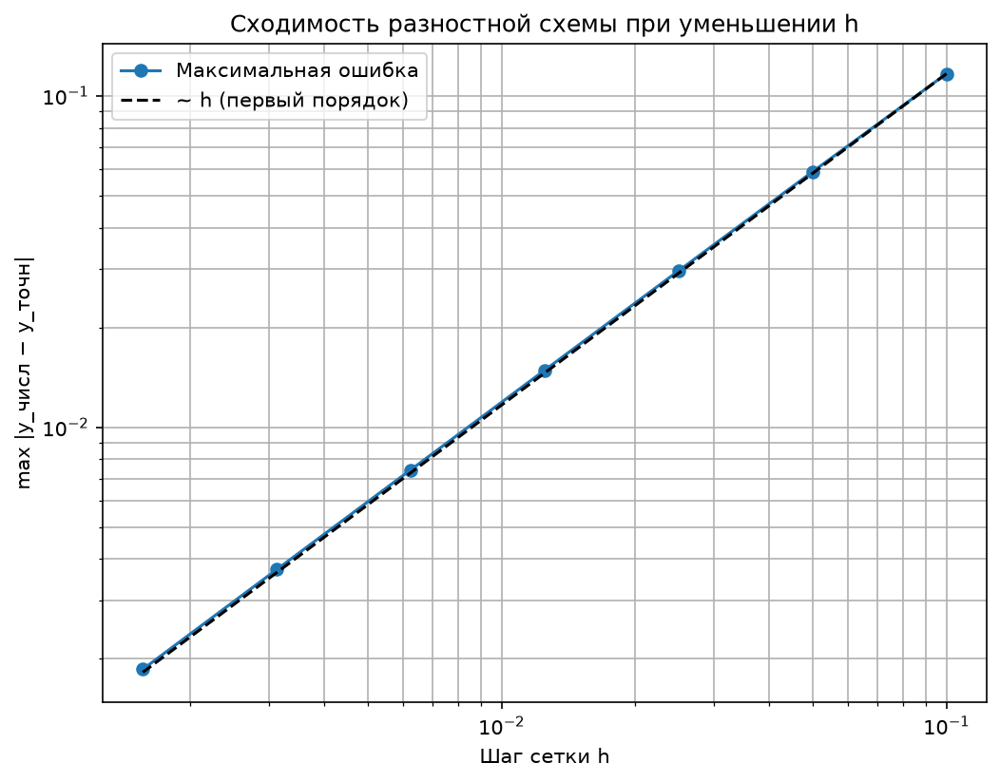

# Численные методы решения краевых задач для ОДУ

Лабораторная работа №6 из учебного пособия Матвеева В. Н. «Лабораторные работы по курсу "Методы вычислений"» (у нас
она идёт второй). Вариант **13**.

## Дано

Краевая задача для линейного дифференциального уравнения второго порядка:

```
y'' + 2y' − 3y = eˣ,   0 ≤ x ≤ 1,

y(0) = 0,   y'(1) = 1,   n = 20.
```

В общем виде из методички это `y'' + p·y' + q·y = f(x)` с краевыми условиями
`α₁·y(a) + β₁·y'(a) = γ₁`, `α₂·y(b) + β₂·y'(b) = γ₂`. У нас:

| a | b | p | q  | f(x) | α₁ | β₁ | γ₁ | α₂ | β₂ | γ₂ |
|---|---|---|----|------|----|----|----|----|----|----|
| 0 | 1 | 2 | −3 | eˣ   | 1  | 0  | 0  | 0  | 1  | 1  |

## Найти

1) Точное решение в узлах сетки `xᵢ = a + i·h`, `h = (b − a)/n`.
2) Построить сеточную краевую задачу и решить её методами:
    * правой (прямой) прогонки;
    * левой (обратной) прогонки;
    * встречной прогонки;
    * стрельбы (пристрелки).
3) Вывести на экран точное и приближённое решение в точках `xᵢ`.

## Структура

* **python/src/main/const.py**: исходные данные варианта и точное решение.
* **python/src/main/methods.py**: построение сеточной задачи и четыре метода её решения.
* **python/src/main/draw.py**: графики на matplotlib.
* **python/src/main/main.py**: запуск всего решения и вывод таблицы в консоль.
* **results**: сохранённые графики.

## Запуск 🚀

```shell
# Запускаем программу из корня репозитория (графики сохранятся в NumericalMethods/Lab2/results);
python NumericalMethods/Lab2/python/src/main/main.py;
```

## Решение

### 1. Точное (аналитическое) решение

Общее решение линейного уравнения: `y = y_однородное + y_частное`.

**Однородное уравнение** `y'' + 2y' − 3y = 0`. Ищем решение в виде `e^(rx)` и получаем характеристическое уравнение

```
r² + 2r − 3 = 0   →   (r − 1)(r + 3) = 0   →   r₁ = 1,  r₂ = −3.
```

Значит, `y_одн = C₁·eˣ + C₂·e^(−3x)`.

**Частное решение.** Правая часть `eˣ` совпадает с одним из решений однородного уравнения (r = 1 — корень), поэтому
частное решение ищем в виде `y_ч = A·x·eˣ` (домножаем на x — это «резонанс»):

```
y_ч'  = A·(1 + x)·eˣ,
y_ч'' = A·(2 + x)·eˣ.
```

Подставляем в уравнение:

```
A·eˣ·[(2 + x) + 2·(1 + x) − 3x] = eˣ   →   A·eˣ·4 = eˣ   →   A = 1/4.
```

**Общее решение:**

```
y(x) = C₁·eˣ + C₂·e^(−3x) + x·eˣ/4.
```

**Подставляем краевые условия.**

* `y(0) = 0`:  `C₁ + C₂ + 0 = 0`, откуда `C₂ = −C₁`.
* Производная: `y'(x) = C₁·eˣ − 3C₂·e^(−3x) + (1 + x)·eˣ/4`.
* `y'(1) = 1`:  `C₁·e + 3C₁·e^(−3) + e/2 = 1`, откуда

```
C₁ = (1 − e/2) / (e + 3·e^(−3)) ≈ −0.125239.
```

**Ответ:**

```
y(x) = C₁·(eˣ − e^(−3x)) + x·eˣ/4,   C₁ = (1 − e/2) / (e + 3·e^(−3)).
```

*Проверка:* `y(0) = C₁·(1 − 1) + 0 = 0` ✅. Программно мы также подставили y(x) в уравнение — невязка ~10⁻⁸ (это
погрешность численного дифференцирования), и `y'(1) ≈ 1` ✅.

### 2. Сеточная (разностная) задача

Делим [0, 1] на n = 20 частей, h = 0.05, `xᵢ = i·h`. Производные заменяем разностями (как в методичке):

```
y'(xᵢ)  ≈ (yᵢ₊₁ − yᵢ) / h,                  — погрешность O(h)
y''(xᵢ) ≈ (yᵢ₋₁ − 2yᵢ + yᵢ₊₁) / h²,         — погрешность O(h²)
```

Подставляем в уравнение и умножаем на h²:

```
yᵢ₋₁ − 2yᵢ + yᵢ₊₁ + p·h·(yᵢ₊₁ − yᵢ) + q·h²·yᵢ = h²·fᵢ.
```

Собираем коэффициенты при yᵢ₋₁, yᵢ, yᵢ₊₁ и получаем вид (6.5) из методички:

```
yᵢ₋₁ + dᵢ·yᵢ + eᵢ·yᵢ₊₁ = gᵢ,   i = 1, …, n − 1,

dᵢ = −2 − p·h + q·h² = −2 − 0.1 − 0.0075 = −2.1075,
eᵢ = 1 + p·h = 1.1,
gᵢ = h²·eˣⁱ.
```

**Краевые условия** (6.4) приводим к виду (6.6): `y₀ = χ₁·y₁ + μ₁`, `yₙ = χ₂·yₙ₋₁ + μ₂`.

* Слева: `α₁y₀ + β₁(y₁ − y₀)/h = γ₁`, откуда `χ₁ = −β₁/(α₁h − β₁)`, `μ₁ = γ₁h/(α₁h − β₁)`.
  У нас `y(0) = 0`, поэтому **χ₁ = 0, μ₁ = 0** (то есть просто `y₀ = 0`).
* Справа: `α₂yₙ + β₂(yₙ − yₙ₋₁)/h = γ₂`, откуда `χ₂ = β₂/(α₂h + β₂)`, `μ₂ = γ₂h/(α₂h + β₂)`.
  У нас `y'(1) = 1`, поэтому **χ₂ = 1, μ₂ = h = 0.05** (то есть `yₙ = yₙ₋₁ + h`).

Получилась система из n + 1 = 21 уравнения с 21 неизвестным y₀, …, y₂₀. Матрица у неё **трёхдиагональная** (в каждой
строке не больше трёх ненулевых чисел), поэтому её решают быстрыми специальными методами.

### 3. Правая (прямая) прогонка

Каждое yᵢ выражаем через следующее: `yᵢ = Qᵢ·yᵢ₊₁ + Fᵢ` (в методичке это qᵢ и φᵢ).

1. Из левого условия: `Q₀ = χ₁`, `F₀ = μ₁`.
2. **Прямой ход** (слева направо), i = 1, …, n − 1:
   ```
   Qᵢ = −eᵢ / (Qᵢ₋₁ + dᵢ),      Fᵢ = (gᵢ − Fᵢ₋₁) / (Qᵢ₋₁ + dᵢ).
   ```
3. Из `yₙ₋₁ = Qₙ₋₁·yₙ + Fₙ₋₁` и правого условия: `yₙ = (μ₂ + χ₂·Fₙ₋₁) / (1 − Qₙ₋₁·χ₂)`.
4. **Обратный ход** (справа налево): `yᵢ = Qᵢ·yᵢ₊₁ + Fᵢ`, i = n − 1, …, 0.

### 4. Левая (обратная) прогонка

Всё зеркально: `yᵢ₊₁ = ξᵢ₊₁·yᵢ + ηᵢ₊₁`.

1. Из правого условия: `ξₙ = χ₂`, `ηₙ = μ₂`.
2. Справа налево, i = n − 1, …, 1:
   ```
   ξᵢ = −1 / (dᵢ + eᵢ·ξᵢ₊₁),      ηᵢ = (gᵢ − eᵢ·ηᵢ₊₁) / (dᵢ + eᵢ·ξᵢ₊₁).
   ```
3. Из `y₁ = ξ₁·y₀ + η₁` и левого условия: `y₀ = (μ₁ + χ₁·η₁) / (1 − χ₁·ξ₁)`.
4. Слева направо: `yᵢ₊₁ = ξᵢ₊₁·yᵢ + ηᵢ₊₁`.

### 5. Встречная прогонка

Правую прогонку ведём слева до узла k, левую — справа до узла k + 1 (берём k = n/2 = 10). Из системы

```
y_k = Q_k·y_(k+1) + F_k,      y_(k+1) = ξ_(k+1)·y_k + η_(k+1)
```

находим `y_k = (Q_k·η_(k+1) + F_k) / (1 − Q_k·ξ_(k+1))` и `y_(k+1)`. Дальше идём влево по формулам правой прогонки и
вправо по формулам левой.

### 6. Метод стрельбы (пристрелки)

Если знать y₀ и y₁, то из разностного уравнения можно по очереди «выстрелить» все остальные значения:

```
yᵢ₊₁ = (gᵢ − yᵢ₋₁ − dᵢ·yᵢ) / eᵢ.
```

Решение ищем в виде `Y = C₁·U + C₂·V + W`, где

* U — решение однородного уравнения (gᵢ = 0) с началом u₀ = 0, u₁ = 1;
* V — решение однородного уравнения с началом v₀ = 1, v₁ = 0;
* W — решение неоднородного уравнения с началом w₀ = 0, w₁ = 0.

Так как y₀ = C₂ и y₁ = C₁, левое условие даёт `C₂ = χ₁·C₁ + μ₁`, а правое —

```
C₁·(uₙ − χ₂uₙ₋₁) + C₂·(vₙ − χ₂vₙ₋₁) = μ₂ − wₙ + χ₂wₙ₋₁.
```

Из этих двух уравнений находим C₁ и C₂.

### Замечание об опечатках в методичке

В формулах методички есть опечатки, в коде они исправлены (формулы проверены прямой подстановкой):

* (6.10): должно быть `φ₀ = μ₁`, а не `φ₀ = χ₁`;
* (6.13): знаменатель `dᵢ + eᵢ·ξᵢ₊₁` (без «+ 1»);
* (6.14): знаменатель `1 − χ₁·ξ₁`, а не `1 − ξ₁`.

## Результаты 📊

Вывод программы (фрагмент таблицы; все четыре метода дают одинаковые числа):

```
  i    x_i       точное     Правая прогонка      Левая прогонка  Встречная прогонка      Метод стрельбы
  0   0.00     0.000000            0.000000            0.000000            0.000000            0.000000
  4   0.20    -0.023165           -0.004417           -0.004417           -0.004417           -0.004417
  8   0.40     0.000069            0.031559            0.031559            0.031559            0.031559
 12   0.60     0.065819            0.107301            0.107301            0.107301            0.107301
 16   0.80     0.177745            0.228130            0.228130            0.228130            0.228130
 20   1.00     0.345371            0.404367            0.404367            0.404367            0.404367

Максимальная ошибка |y_числ - y_точн|: 5.899646e-02 (у всех методов)
Наибольшее расхождение между методами: 2.220e-16

Сходимость (правая прогонка):
    n          h         ошибка   ошибка/h
   10    0.10000   1.166157e-01     1.1662
   20    0.05000   5.899646e-02     1.1799
   40    0.02500   2.964833e-02     1.1859
   80    0.01250   1.485890e-02     1.1887
  160    0.00625   7.437788e-03     1.1900
  320    0.00313   3.720935e-03     1.1907
  640    0.00156   1.860972e-03     1.1910
```

Полную таблицу по всем 21 узлу программа печатает при запуске.







## Выводы

* Все четыре метода (три прогонки и стрельба) дают **одно и то же** решение сеточной задачи — расхождение ~10⁻¹⁶,
  то есть только ошибки округления. Это ожидаемо: они решают одну и ту же систему уравнений, просто разными способами.
* Отличие сеточного решения от точного (≈ 0.059 при n = 20) — это **погрешность самой разностной схемы**, а не методов
  прогонки. Первая производная заменена односторонней разностью `(yᵢ₊₁ − yᵢ)/h` с погрешностью O(h), поэтому вся
  схема имеет первый порядок: при уменьшении h вдвое ошибка тоже уменьшается вдвое (столбец «ошибка/h» почти
  постоянен, а на графике сходимости точки ложатся на прямую ~h).
* Если заменить y' центральной разностью `(yᵢ₊₁ − yᵢ₋₁)/(2h)`, схема стала бы второго порядка O(h²), но в
  методичке предложена именно такая схема, поэтому мы следуем ей.
